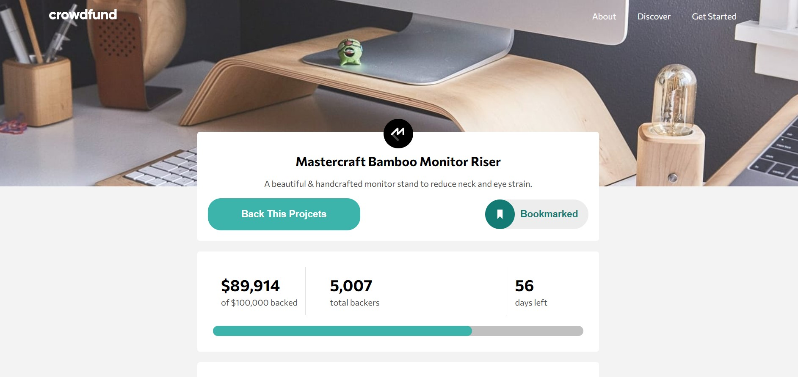

# Frontend Mentor - Crowdfunding product page solution

This is a solution to the [Crowdfunding product page challenge on Frontend Mentor](https://www.frontendmentor.io/challenges/crowdfunding-product-page-7uvcZe7ZR). Frontend Mentor challenges help you improve your coding skills by building realistic projects. 

## Table of contents

- [Overview](#overview)
  - [The challenge](#the-challenge)
  - [Screenshot](#screenshot)
  - [Links](#links)
- [My process](#my-process)
  - [Built with](#built-with)
  - [What I learned](#what-i-learned)
  - [Continued development](#continued-development)
- [Author](#author)

**Note: Delete this note and update the table of contents based on what sections you keep.**

## Overview

### The challenge

Users should be able to:

- View the optimal layout depending on their device's screen size
- See hover states for interactive elements
- Make a selection of which pledge to make
- See an updated progress bar and total money raised based on their pledge total after confirming a pledge
- See the number of total backers increment by one after confirming a pledge
- Toggle whether or not the product is bookmarked

### Screenshot



### Links

- Solution URL: (https://www.frontendmentor.io/solutions/responsive-landing-page-using-flexbox-Hks4cAbQc)
- Live Site URL: (https://blurryface1998.github.io/crowdfunding-product-page-main/)


## My process

### Built with

- Semantic HTML5 markup
- CSS custom properties
- Flexbox
- CSS Grid
- Mobile-first workflow
- JavaScript

### What I learned

In this project, I learned how to change the border and display the div element on the radio button click. I have also learned how to make a modal and display it on click.

```css
.main__modal {      
        display: none;
        position: fixed;
        z-index: 1;
        padding-top: rem(70);
        padding-bottom: rem(70);
        left: 0;
        top: 0;
        width: 100%;
        height: 100%;
        overflow: auto;
        background: rgba(0, 0, 0, 0.4);
}
```
```js
btnOpenModal.addEventListener("click", function() {
    modalB.style.display = "block";
    body.style.overflow = "hidden";
});

function toggle(element) {
}
toggle(document.querySelectorAll(".parts"));
```
### Continued development

Need to work on my id class and other selection in JavaScript, couldn't figure out how to change class= "amount-left" on one but not on the other when I click the button continue.

## Author

- Website - [Djordje Rajc]
- Frontend Mentor - [@Blurryface1998](https://www.frontendmentor.io/profile/Blurryface1998)
- Twitter - [@Blurryface_1998](https://twitter.com/Blurryface_1998)